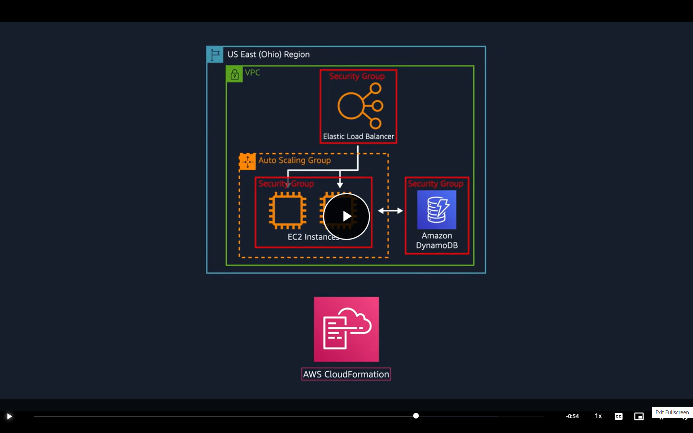
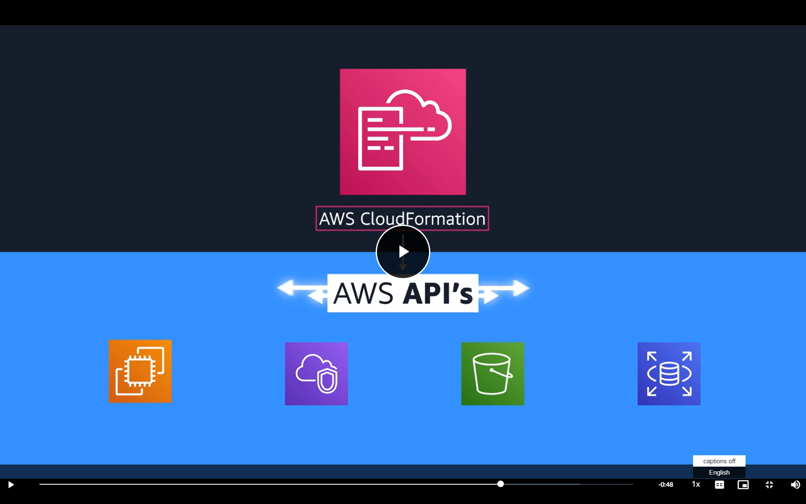

# Module Three: Global Infrastrcuture and Reliability

Introduction: not a good idea to have one giant data centre. Instead AWS operates in all sorts of different areas around the world called REGIONS

## AWS Global Infrastructure

Historically companies would have to run their applications on their own data centres.

> Fundamental problems with data centres: events can happen that cause you to lose connection with this building

Options: 

a. Run a second data centre --> expensive 
b. Store backups --> most businesses store backups and hope the above day never happens 

ANSWER: AWS builds regions closest to wherever the business traffic demands are --> eahc region can be connected to another region through a high speed fibre NW (all of which is done by AWS)

Note: You can choose which region you want to run out of 

_Security Consideration: each region is isolated from each other region in the sense that no data will move in and out of that region without you explicitly granting access for that data to be moved._

- For Example: You might have government compliance recquirements where your information in Frankfurt cannot leave Germany (and same with other locations across the globe)
    - Only way to overcome this is if you with the right credentials and permissions request for the data export to happen

### Selecting a Region - Four Key Factors 

1. Compliance with data governance and legal requirements
    - Is the data region speicifc and cannot be exported from it
    - not all companies have 
2. Proximity
    - How close are you to your customer base 
    - latency -> time it takes for data to be sent or recieved 
3. Feature Avaialbility
    - sometimes the closest region may not have access to the correct AWS features you require
4. Pricing
    - Even if the HW itself is exactly the same, it can cost significantly more to run the same set of services on the same set of HW in different regions
    - SOA Paula can be 50% more expensive than running out of Oregan for example

_Selecting a Region for your services, data and applications must consider all of the above factors_

### Availability Zones 

Don't want to run an application in a single building -> regions are not one location, each region comprises of multiple data centres

Single or group of data centres == availability zone

- one or more discrete data centres with redundant power, NW'ing and connectivity 

 us-west-1 Region Example: 

EC2 instance running on a virtual machine on a physical HW within an Availability Zone

Each AWS Region contains multiple isolated availability zones -> you don't luanch all of this within a small space of each other in case nautral distasters occur (but not too far away such that the latency increases)

10's of miles and can still keep single digit ms latency

Example of Availability Zone failure: 

- Here this means if us-west-1a were to fail, your application would still be running in us-west-1b.

#### ELB is a Regional Construct

It runs across all availability zones communicating with all EC2 instances

Any service listed as a Regionally Scoped Service means you have this covered and these services are already highly available (at no additional cost or effort on your part)

Many of the services amazon provide run at regional level across multiple AZs

Note: planning for failure and running across mltiple availability zones is an important part of building a resilient and highly available architecture 

## Edge Locations

AWS Global Infrastrcuture engineered to enable you to reach customers across the world. Edge Location == site that used AWS CloudFront to store cached copies of your content closer to your customers for faster delivery

CDNs --> content delivery networks, aws version is amazon cloudfront

Can push content from inside a region to various edge locations acorss the world. Uses DNS (Domain Name Service) helping direct customers to the correct edge locations with reliably low latency

AWS Outposts - install full operational mini region from inside your own building/ data centre, not a solution that most customers need

1. Regions -- geogrpahically isolated areas where you can access services needed to run your enterpirse
2. Edge Locations run amazon cloud front to help get content faster to your customers no matter where they are in the world

Note in the example above, Amazon CloudFront retrieves the file from the cache in the edge location and delivers the file to the customer

Within this construct Edge run Domain Name Service (Amazon Route 53) to help direct customers to the correct web locations

## How to Provision for AWS Resources

### Part One 

#### Video 

- In AWS everything is an API call, stands for Application Programming Interface
- Predetermined ways to interface with components
- AWS Management console, AWS command line interface, AS Cloud Formation, all of which can be used via APIs
- AWS Management Console
    - test environment creation 
    - view AWS Bills 
    - View Monitoring
    - Work with non-technical resources
    - Most likley first place to go when learning about AWS

Use tools to script API calls
- AWS Command Line Interface (CLI) allows you to make API calls using the terminal on your machine 
- As opposed to moving through check boxes on the AWS management console
- CLI makes actions scriptable and repeatable
- CLI less suseptible to human error and can have these scripts run automatically

Or Use SDKs (Software Development Kits)
- Interact with various AWS resource using different programming languages
- Makes it easy for developers to create programmes that use AWS without the low level APIs
- AWS provides documentation and sample code for each supported programming language

#### Part Two

#### Video

So we have the "do it yourself" ways: 
- AWS Management Console
- CLI 
- SDKs

Other ways to manage AWS Environment like:

1. AWS Elastic Beenstalk:Service that helps you provision EC2 based Environments
    - This allows you to provide just the application code and desired configs to the EB service which takes this info and builds out your environment for you
    - also allows you to save the env. configs so they can be redeployed for you
    - Means you do not have to provision and manage all the pieces serparately
    - FOCUS ON THE BUSINESS APPLICATION NOT THE INFRASTRUCTURE 
    - Deploys the resources necessary for the following tasks: 
        - Adjust capacity
        - Load balancing
        - Automatic scaling
        - Application health monitoring

2. AWS Cloud Formation: Infratstructure as Code (IaC) tool that is used to define a wide variety of AWS Resources
    - defined using json or yaml files, called cloud formation templates 
    - allows you to define what you want to build without the details of how you want to build it
    - Not limited to EC2 based solutions
    - Covers:
        - storage
        - databse
        - analytics 
        - machine learning 
    - Once defined in the template, cloud formation will parse and begin provisioning all the resources you define in parrallel
    - manages all the back end api calls for you 
    - completed automated process 

## Module Three Summary 

1. Logical Clusters of data centres make up availability zones 
2. Availability Zones make up regions 
3. Always deploy services across at least two availability zones
    - consider the above in conjunction with SNS (Simple notification service), ELB (Elastic Load Balancing) and SQS (Simple Queue Service)
4. Edge Locations  == sites that used AWS CloudFront to store cached copies of your content closer to your customers for faster delivery
5. AWS Outposts -> run aws infrastructure right in your own data centres 
6. Provisioning AWS Resources
    - AWS Management Console
    -  SDK AND CLI 
        - SW Dev Kit
        - Cmd Line Interface
    - Elastics Beanstalk and Cloud Formation