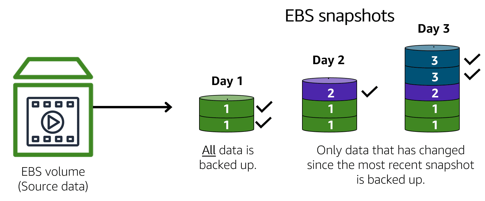
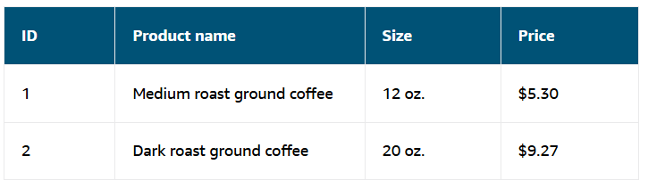
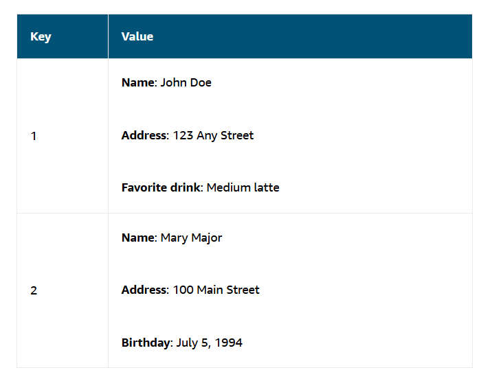

# AWS Storage and Databases

## Module Introduction 

- Summarise the basic concept of storage and databases
- benefits of EBS
- benefits of S3
- benefits of EFS
- Various storage solutions
- benefits of RDS 
- benefits of Dynamo DB 
- summarise various DB services

_Need digital data to be able to keep track of customers, what they have ordered, how much they have purchased -> need DBs and storage_

## Instance Stores and EBS

### Instance Stores

- Block- level storage volumes behave like physical hard drives
- Instance store provides tempoerary block-level storage for an EC2 instance
- Instance store is a disk storage physically attached to the host computer for an EC2 instance, when instance is terminated, you lose the data in the instance store

_Perfect for use cases where you want to persist data_

Amazon EBS: Service which provides block-level storage columes that you can use with EC2 instances, if you stop or terminate an EC2 instance, all the data attached to the EBS volume remains available

To create an EBS volume, you define the config (volume size and type), once created, attach to an EC2 instance 

### EBS Snapshots

You can take incremental backups of EBS volumes by creating Amazon EBS snapshots.

- EBS snapshot is an incremental back up 
- first back up takes copies of all
- subsequent takes only the data blocks that have changed since the last snapshot was saved
- Full back ups are where all the data in a storage volume copies each time the backup occures 
    - full backup includes data that has not changed since the most recent backup 

## Simple Storage Service (Amazon S3)

### Object Storage

In object storage each object consists of:

1. Data 
    - Image
    - Video
    - Text Doc 
    - Other file types
2. Metadata
    - where data is 
    - how it is used
    - object size 
3. Key 
    - key is objects unique identifier 

### Amazon Simple Storage Service (S3)

- Service that provides object level storage
    - S3 stores data as objects in buckets
- Uploae any file type to S3
    - Images
    - Videos 
    - Text files
    - back up files
    - media files 
    - archived documents
- Max file size is 5TB but has unlimited capacity
- When uploading files to S3 can ser permissions for visibility and access to it

### S3 Storage Classes

- Pay for what you use
- choose from a range of storage classes - consider: 
    - how often you plan to retrieve your data 
    - how available it needs to be

#### S3 Standard

- designed for frequent data access
- stores data in minimum 3 avail zones
- high availability, good for UCs such as 
    - websites 
    - content distribution
    - data analytics

Note: S3 Standard has a higher cost than other storage classes intended for infrequently accessed data and archival storage

#### Standard Infrequent Access - S3-IA

- Ideal for infrequently accessed data
- similar to S3 but lower storage price and higher retrieval price
- store in min 3 avail ZN

#### S3 One Zone - IA

- stores data in a single avail ZN
- lower storage price than S3-IA
- Compared to S3 and S3-IA, One ZN-IA stores in a single Avail ZN
- Good for following UCs:
    - save costs on storage
    - you can easily reporduce your data in the event of AZ failure

#### S3 Intelligent Tiering

- Ideal for data with unknown or changing access patterns 
- requires small monthly monitoring and automation fee per object

Here Amazon S3 monitors objects access patterns:

    - If you haven't accessed an object for 30 consecutive days, S3 automatically moves it to infrequent access tier --> S3-IA
    - If you access an object in the infrequent access tier, Amazon S3 automatically moves it to the frequent access tier, S3 Standard.

#### S3 Glacier Instant Retrieval

- Works well for archived data that requires immediate axccess
- retrieval within millisecs
- Can perform within ms with the same performance as S3 standard

#### S3 Glacier Flexible Retrieval 

- Low-cost storage designed for data archiving
- able to retrieve objects within a few mins to hours
- Use cases:
    - archived customer records 
    - older photos and video files

#### S3 Glacier DeepArchive 

- lowest cost object storage class ideal for archiving
- able to retrieve objects within 12 hours 
- supports long-term retention and digital preservation for data that might be accessed once or twice in a year
- 12- 48 hrs retrieval time 
- all  objects in this region are replicated and stored across at least 3 geoprgraphically dispersed AZs

#### S3 Outposts

- create S3 buckets on S3 Outposts
- makes it easier to retrieve, store and access data on AWS Outposts
- designs data durably and redundantly across mutliple devices and servers on your outposts

_It works well for workloads with local data residency requirements that must satisfy demanding performance needs by keeping data close to on-premises applications_

### Comparing Amazon EBS and Amazon S3

|Amazon Elastic Block Store | Amazon Simple Storage Service          |
|--------------------   |-----------|
|Sizes up to 16TiB      | Unlimited storage          |
| Surivive Termination of their EC2 Instance | individual objects up to 5000GBs          |
| Solid state by default| Write once/ read many          |
|HDD Options            | 99.999999999% durability |

Object storage treats any file as a complete descrete object, but every time there's a change to the object you need to re upload the entire file 

block storage breaks files down into small component parts or blocks - to allow block uploads for updated sections only: EBS perfect UC for this

Complex read/write change functions -> EBS

Complete objects, occasional changes -> S3

## Amazon Elastic File System (EFS)

### File Storage

multiple clients such as users, applicatons, servers etc can access data stored in shared file folders:

- in this approach storage server uses block storage with local file system to org files. clients access data through file paths 

EFS == scalable file system used with AWS Cloud and on-premise resources, as you add and remove files EFS grows and shrinks automatically

- can scale on demand to petabytes without disrupting applications

### EBS vs EFS

#### EBS 

- EBS stores data in a single AZ
- To attach EC2 to an EBS both the EC2 and the EBS must reside within the same AZ 

#### EFS

- Regional service storing data across multiple AZs 
- duplicate storage enables you to access data concurrently from all AZs in the region where the file systems located 
    - also can have on premise servers that can access EFS using direct connect

## Amazon Relational Database (RDS)

### Relational Databases

- in a relational DB, data is stored in a way that relates it to other pieces of data 

For example: coffee shop inventory management system -> each record in the db would include data for a single item, being product name, price, size and so on

Relational DBs use SQL, to store and query data. SQL == Structured Query Language. Allows data to be stored in an easily understandable, consistent and scalable way

### Amazon Relational DB Service

- A service that enables you to run relational DBs in AWS Cloud
- RDS is managed service that automates tasks such as HW provisioning, DB setup patching and backups 
- this means you can spend less time doing admin and more time using data to innnovate your applications 

Can integrate with other AWS Services such as using AWS Lambda to query your db from a serverless application

Many RDS DB engines offer encryption at rest - protecting data when stored and encryption in transit, meaning its protected when being sent or received

### RDS DB Engines

Available on six DB engines which optimise memory, performance or input/output (I/O)

Supported DB engines include:
- Amazon aurora
- PostgreSQL
- MySQL
- MariaDB
- Oracle DB
- Microsft SQL Server

### Amazon Aurora

Aurora is an enterpirse class relational DB and is compatible with MySQL and PostgreSQL DBs. Up to five times faster than standard MySQL DBs and up to 3 times faster than PostgreSQL DBs

Note, PostgreSQL is PostgreSQL is a powerful, open-source, object-relational database management system (RDBMS)

Consider Aurora if your workloads require high availablility -> It replicates six copies of your data across three Availability Zones and continuously backs up your data to Amazon S3

## Amazon Dynamo DB

### Nonerelational DBs

In a nonrelational DB, you create tables -> table == place where you store and query data 

- Nonrelational DBs sometimes referred to as NoSQL DBs because they use structures other than rows/ columns to organise data
- One type of structural approach for this is key-value pairs 
    - here data is orngaised into items (keys) which have attributes (values)
- In key value DB you can add or remove attributes from items in the table at any time. additionally, not every item in the table has to have the same attributes

### Dynamo DB 

Dynamo DB is a key-value DB service that delivers single-digit millisecond performance at any scale 

Serverless: Dynamo DB is serverless meaning you do not have ot provision, patch or manage servers 

Serverless databases are managed database services offered by cloud providers where the underlying infrastructure and database management system are handled by the provider, not the user

You also do not have to install, maintain, or operate software

Automatic Scaling: As your DB grows or shrinks, Dynamo automatically adjusts changes in capacity whilst maintaining consistent performance --> perfect for UCs requiring high performance whilst scaling

### RDS vs DynamoDB

#### RDS

- Automatic high availability recorvery provided
- customer ownership of data
- customer ownership of schema
- customer control of NW

#### Dynamo DB

- key-value pair
- global DB at touch of a button 
- PB size potential 
- granular API access

#### UCs

- RDS is built for business analytics (when you need complex relational joins)
- Imagine employee contact list - single table terrirory 
    - dynamo DB --> none relational dbs creating powerful and fast dbs where you do not need complex relations

## Amazon Redshift

Data warehousing service that you can use for big data analytics, it offers the ability to collect data from many sources and helps you understnad relations an trends across your data 

Datawarehouses are engineered for big data - usually looking at historical analytics as opposed to operational analysis

    - key thing is data is now set 
    - ie as long as question is looking backwards then datawahreous soluton is the correct one to go for 

AMAZON REDSHIFT == DATAWAREHOUSING AS A SERVICE dealing in multiple petabyte sizes. Redshift gives you up to 10x higher performance than traditional DBs

Key point - when you need big shata solutions, red shift allows you to get started with a single api call

## AWS Database Migration Service 

### AWS DMS

AWS DMS enables you to migrate relational dbs, nonerelational dbs, and other types of data stores 

With this service you move data btwn source and target dbs, both of which can be the same or of different tpyes. during migration your db remains operational - thereby reducing downtime for any application which rely on it

### Other UCs for AWS DMS

1. Dev and test of DB migrations: enables devs to test apps against prod data without affection production users
2. DB consolidation: combining severalDBs into single DB
3. Continous replication - sending ongoing copies of your data to other target sources instead of doing a one-time migration

## Additional Database Services

### Document DB

- document DB service that supports Mongo DB workloads 
- note Mongo DB is a document DB program

### Neptune

- Neptune is a graph database service 
- can use Neptune to build and run applications that work with highly connected datasets
- such as recommendation engines, fraud detection and knowledge graphs

### Quantum Ledger Database (QLDB) 

- This is a ledger database
- Used to review complete history of all the changes that have been made to your application data

### Managed Blockchain

- service that you can use to create and manage blockchain networks with open source frameworks 
- blockchain is a distrubted ledger system that lets multiple parties run trasnations and share data without centre authority

### ElastiCache

- service that adds caching lauers on top of your dbs to help imrpove read times for common requests 
- two types of data stores: Redis and Mechached

### DynamoDB Accelerator

- in memory cache for Dynamo DB
- imrpoves response times from single digit ms to micro-seconds

## Module Five Summary

- EC2 instance store and EBS 
- Amazon S3
- Amazon EFS
- Relational Databases and Amazon RDS
- Nonrelational DBs and Dynamo DB
- Redshift
- AWS DMS
- Addditional DB services and accelrators