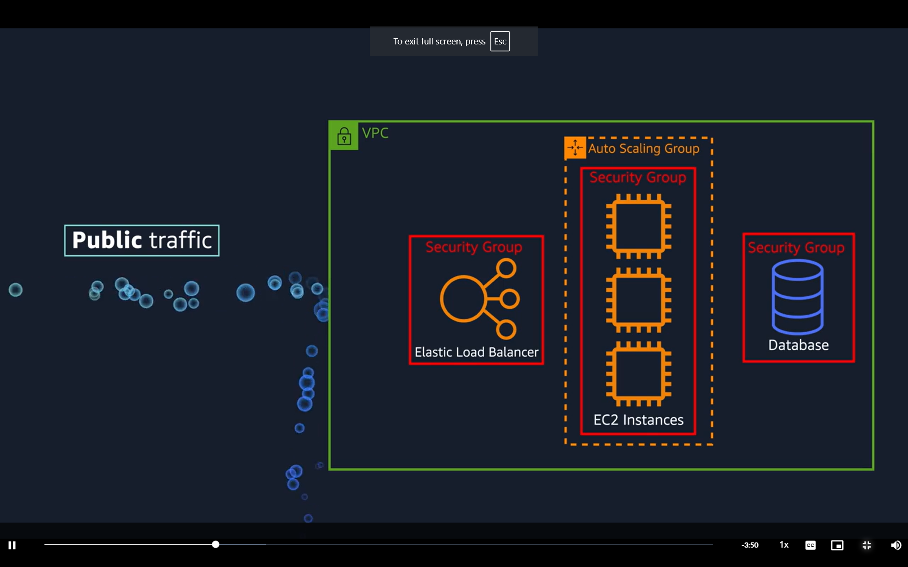
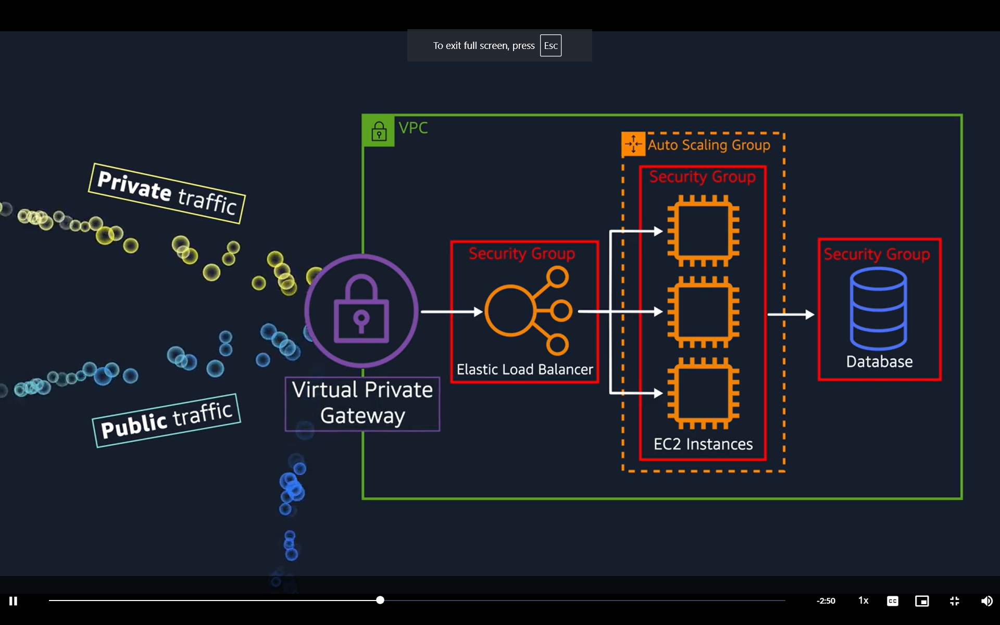
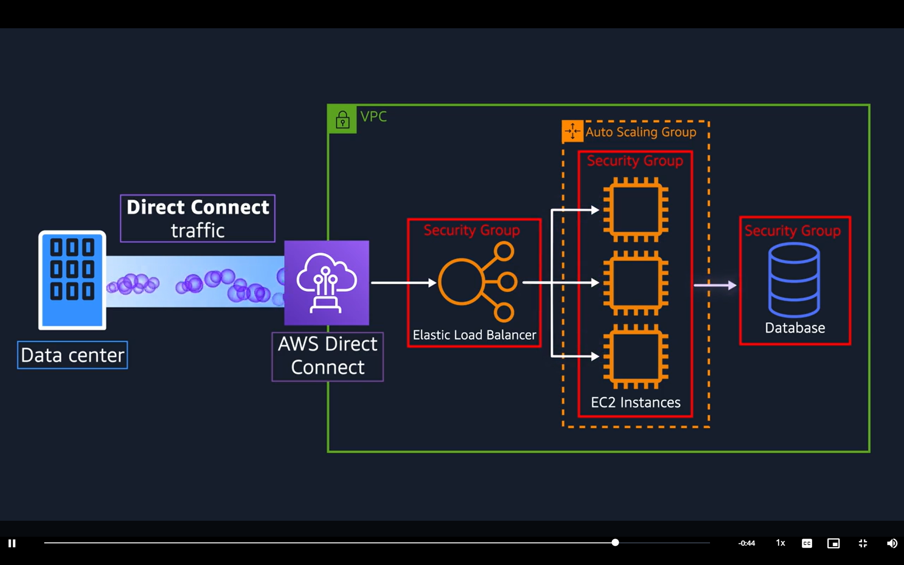
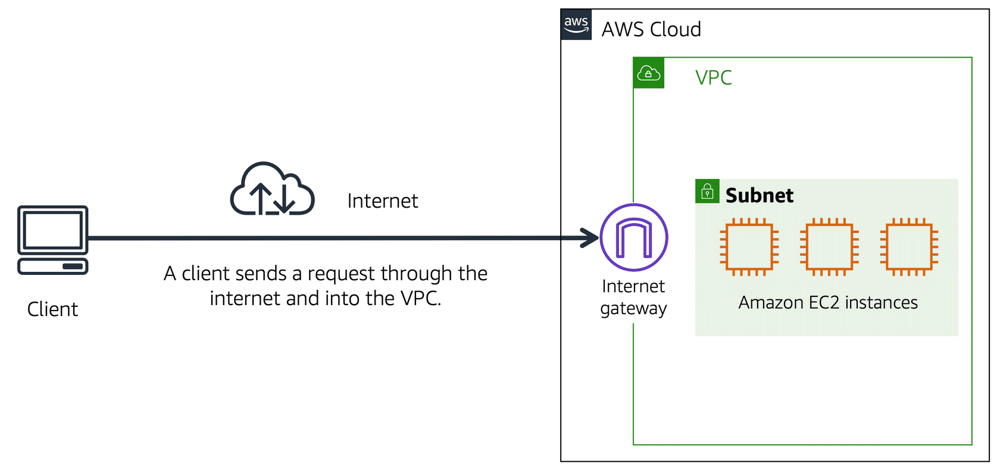
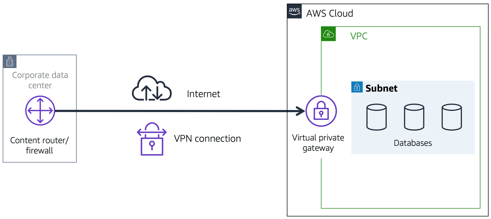
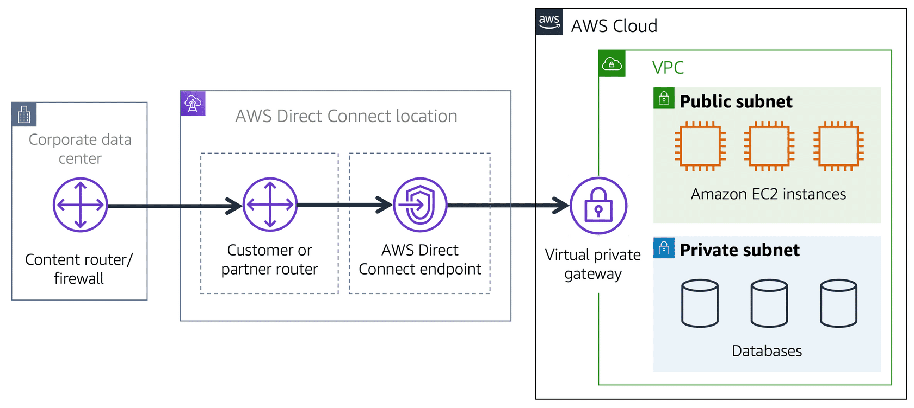
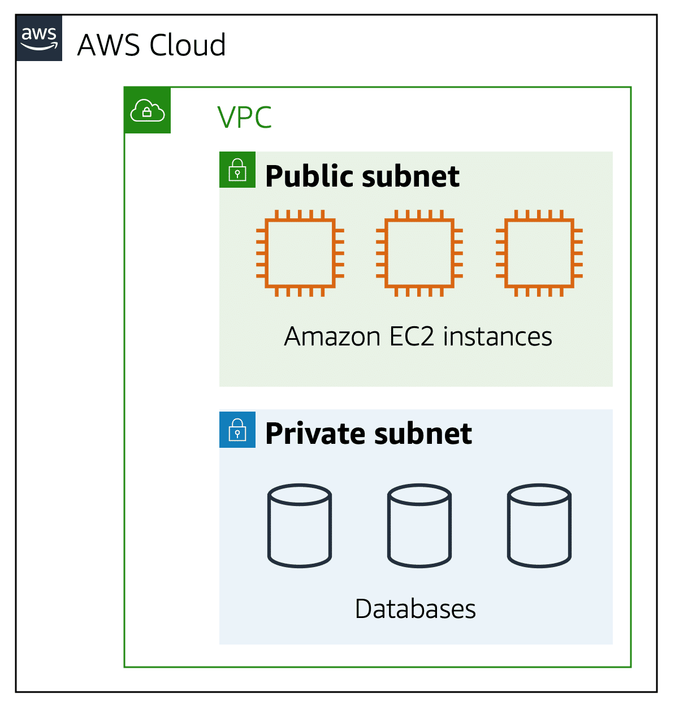
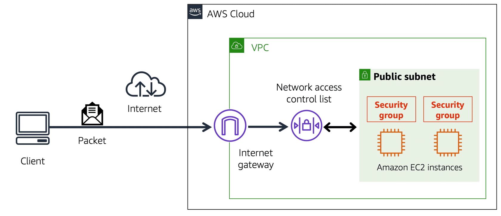
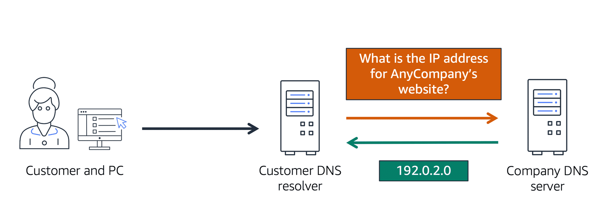
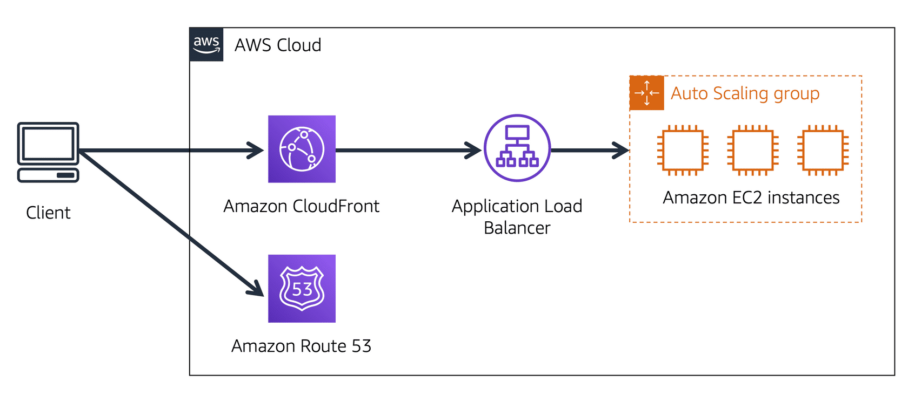

# Module Four Networking

## Introduction

- Basic NWing Concepts
- Diff btwn pub and priv resources
- Explain a virtual private GW
- Explain a virtual Private Network (VPN)
- Benefit of AWS Direct Connect
- Benefits of Hybrid Deployments
- Layers of Security used in IT
- Services customers use to inteact with the AWS Global NW

Sales Tills - Public Subnet
Barristas - Private Subnet

Amazon VPC == Virtual Private Cloud 

Subnets = range of IP's in VPC

## Connectivity to AWS 

### Video

VPC: Our own private NW in AWS
    - Define private IP range for AWS Resources
    - Subnets = chunks of Subnets in your VPC that allow you to group resources together 
    - Place EC2s and ELBs inside of VPC
        - Place them into different subnets 
        - Subnets plus NWing rules control whether resources are publicly or privately available

#### Public Facing Rseources

IGW required to allow public access to VPC

#### VPC with private Resources

Virtual Private GW allows you to create a VPN connection to allow only approved users into the private internal AWS resources.

**Problem with VPNs** They are private and encrypted but still use a regular internet connection that has bandwidth being shared with many people across the internet

_We want the lowest amount of latency with the highest security_ 

This is where AWS Direct Connect comes in:

### Amazon VPC 

A networking service that you can use to establish boundaries around your AWS resources is Amazon Virtual Private Cloud.

VPC enables you to provision an isolated section fo the AWS Cloud where you can launch resources in a virtual network that you define.

### Internet GW

To allow public traffic from the internet to access your VPC, you attach an internet gateway to the VPC

### VPG

VPN connection encrypts your internet traffic from all the other requests around it

- Extra protection but still using the same internet connection with limited bandwidth as other users online

### Direct Connect

Dedicated private connection between your data centre and a VPC

The private connection that AWS Direct Connect provides helps you to reduce network costs and increase the amount of bandwidth that can travel through your network

## Subnets and Network Access Control Lists

In a VPC, subnets  are separate areas that are used to group together resources

### Subnets

A Subnet is a section of a VPC in which you can group resources based on security or operational needs - these of which can be public or private 

- Public Subnets: contain reources that need to be accessible by the public
- Private Subnets: resources only to be accessed via your private NW such as DBs that contain PII

In a VPC, subnets can communicate with one another. Eg app involving ec2a in public subnet communicating with DBs on private subnet

### NW Traffic in a VPC 

A packet is a unit of data sent ov et the internet or a NW

Enters into a VPC through an IGW, before entering, permissions are checked, these permissions indicate who sent the packet and how the packet is attempting to communicate with resources in the subnet 

The VPC component that checks packet permissikons for subnets is an ACL (NW Access Control List)

### Network ACLs

virtual firewall that controls inbound and outbound traffic at a subnet level

Each AWS account includes a default nw ACL - when configuring your VPC you can use the defualt or create customs 

DEFAULT ALLOWS ALL INBOUND AND OUTBOUND TRAFFIC 

For Custom, ALL IS DENIED UNTIL you add rules to specify which to allow 

### Stateless Packet Filtering

NW ACLs perform stateless packet filtering - meaning they remeber nothing and check packets entering both inbound and outbound 

When a packet response for the request comes back to the subnet, the network ACL does not remember the previous request and checks against list of rules whether to allow or deny

### Security Group

A security group is a virtual firewall that controls inbound and outbound traffic for an Amazon EC2 instance

By default a security group denies all inbound traffic and allows all outbound traffic 

Custom rules can be added to configure which traffic should be allowed, any traffic other than that will be denied

Multiple EC2 within same VPC, you can associate with same security group or use different secruity groups for each instance

### Stateful Packet Filtering 

Security Groups perform stateful packet filtering meaning they remember the decisions made against previous incoming packets 

### ACL and Security Group Overview 

REMEMBER VPC == Amazon Virtual Private Cloud

1. Private Subnet: Isolated DBs containing customers PII
2. Virtual Private Gateway: Create a VPN connection between the VPC and the internal corporate NW 
3. Public Subnet: Support the customer facing website
4. AWS Direct Connect: Establish a dedicated connection between on-premises data centre and the VPC 

## Global Networking

### Domain Name System

DNS resolution involves a customer DNS resolver communicating with a company DNS servicer. DNS is the phonebook of the internet - DNS resolution is the process of translating a domain name to an IP Address.

1. Enter domain name in your browser, request is sent to a customer DNS resolver 
2. Customer DNS resolver ask the company DNS servicer for the IP address that corresponds to the requested website
3. Company DNS servicer responds by providing the IP adddress for the website

The above is essentially: client connects to a DNS resolver looking for a domain -> resolver forwards request to the DNS server, which then returns the IP address to the resolver. 

### Amazon Route 53

Route 53 is a DNS web service and it gives deveopers and businesses a reliable way to route end users to internet applications hosted in AWS 

Route 523 connects user requests to infrastrcuture running in AWS (such as EC2s or ELBs). Can route users to infrastructure outside of AWS

Route 53 also able to manage DNS records for Domain names. Ie can register new domain names directly in Route 52. Can also transfer DNS records for existing names managed by other domain registrars. therefore enables you to manage all domain names in single location 

### Example of How the Two Deliver Content 

1. Customer requests data from application by going to company website
2. R53 uses DNS to identify corresponding IP address to website requested and sends this back to customer
3. Customer request sent to nearest Edge Location through Amazon CloudFront
4. CF connects to App Load Balancer which sends incoming packet to an EC2 instance

## Module Four Summary

Learnt about:

1. Structuring and connecting to a VPC 
2. Securing VPC resources with NW ACLs and Security Groups
3. R53 and CloudFront to deliver content