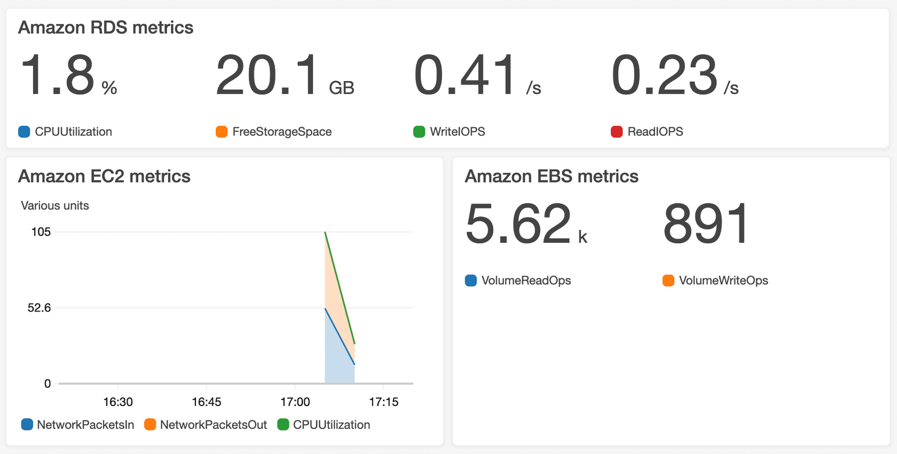
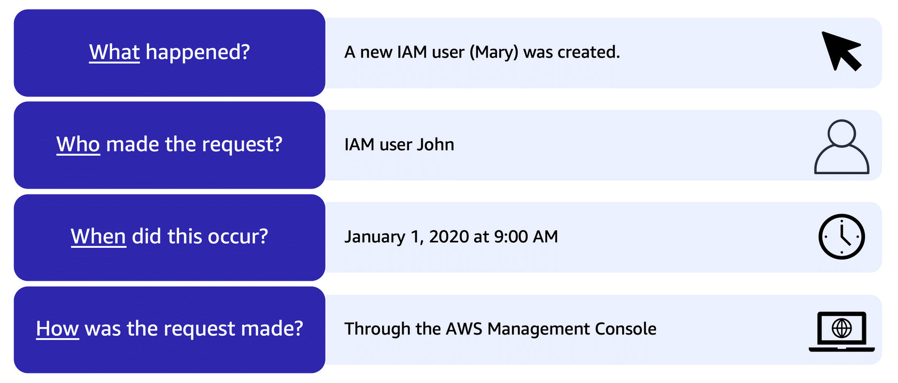
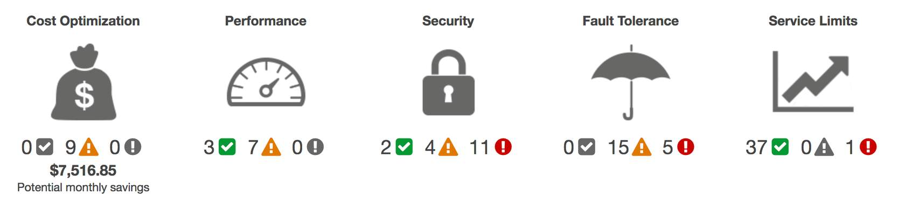

# Module Seven: Monitoring and Analytics

## Intro

- Summarise approaches to monitoring your AWS environment 
- benefits of CloudWatch
- benefits of CloudTrail 
- benefits of AWS Trusted Advisor

## Amazon CloudWatch

- Need visibility into the state of your systems 
- Is your operation working successfully
- need to be able to monitor health and operations of your solutions
- CloudWatch
    - monitors in real time 
    - can create custom metrics 
    - cloud watch alarm - set threshold for metric, when met it triggers an action 
    - SNS integration possible with cloud watch
- Dashboard 
    - Screen listing out metrics in near real time
- CloudWatch Benefits 
    - access to all metrics from central location 
    - gain visibility into your applications, infrastrcuture and services
    - MTTR == Mean Time to resolution 
    - TCO == Total cost of Ownership

### Amazon CloudWatch

- web service that enables you to monitor and manage various metrics and configure alarm actions based on data from said metrics
- Uses metrics to create graphcs and show performance changes over time

### CloudWatch Alarms

- create alarms that perform actions if value defined meets threshold 
- Eg if your company use EC2 instances for app dev or testing purposes, if devs forget to stop the instances, Cloudwatch can automatically stop the EC2 instance from running when the CPU utlilisation % meets a defined threshold

### CloudWatch Dashboard

- Use to monitor CPU utilisation of an EC2 instance
- Use to monitor the total number of requests made to an S3 Bucket 
- Customise seaprate dhasboard for different business purposes, applications or resources

## Amazon CloudTrail

- Need to be able to audit transactions in IT
- Source control is critical 
- Everthing is programmatic
- CloudTrail is comprehensive API Auditing tool
    - every API request gets logged in the CloudTrail Engine
    - What was the request, what was the response, was the request denied, if so why etc. 

### CloudTrail 

Record information includes:

- the identity of the API caller
- the time of the API call 
- the source of the IP address of the API caller

Events are typically updated in the CloudTrail 15 mins after an API call 

### AWS CloudTrail Event Example

 - For example, someone creates a new IAM User
    - but they do not know who, what, when or which method was used to create the user
- CloudTrail enables you to apply a filter to display only the "createuser" API action events in IAM
    - From this owner locates event for API call that created the IAM user for Mary

### CloudTrail Insights

- Optional Feature that allows CloudTrail to automatically detect unsual API activites in your AWS Account
- Eg detecting higher number of EC2 event instances then usual

## AWS Trsuter Advisor 

- When running AWS, might need some advisors who can come in from the outside 
- AWS Automated Advisor that evaluates your resources against 
    - Cost Optimisation
    - Perfroamcen
    - Security
    - Fault Tolerance 
    - Service Limits 
- Can view them directly in AWS Management Console
- Some checks include
    - turning off under utilised EC2 instances
    - MFA being turned off for Root User
    - Security groups allowing public access to EC2 instances

### AWS Trusted Advisor 

- Inspects AWS Env and provides real time recommendations in accordance to best practices
- Guidance provided can benefit at all stages of deployment 

### Dashboards

- green indicates the number of items for hwich theres no problems
- orange == recommended investigations 
- red == actions needed

