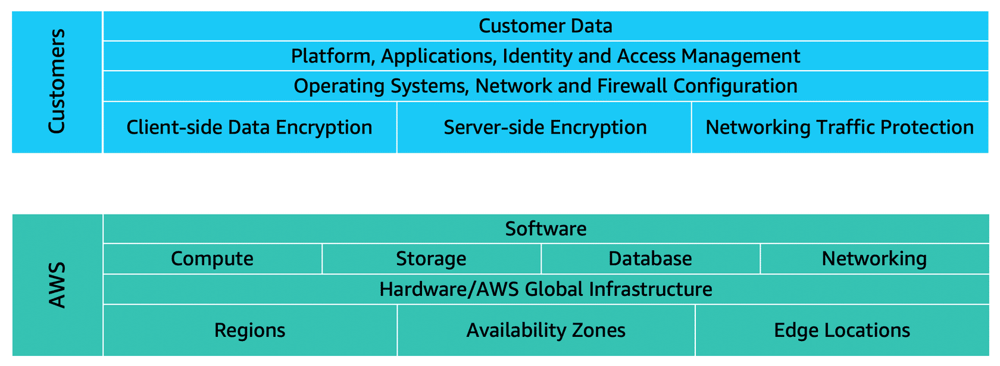
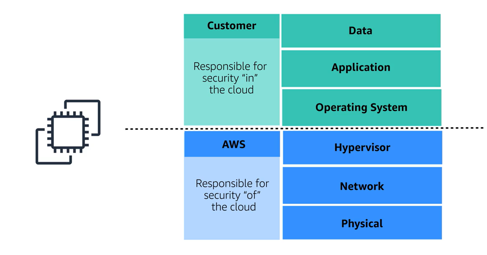
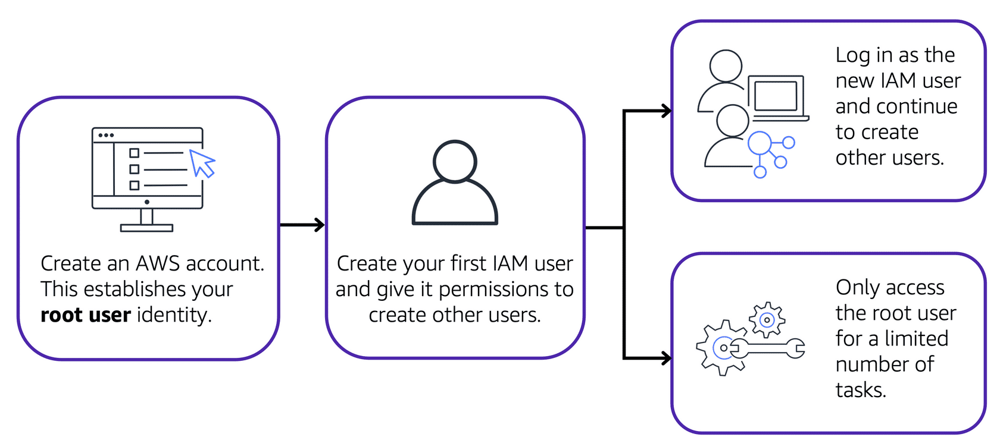
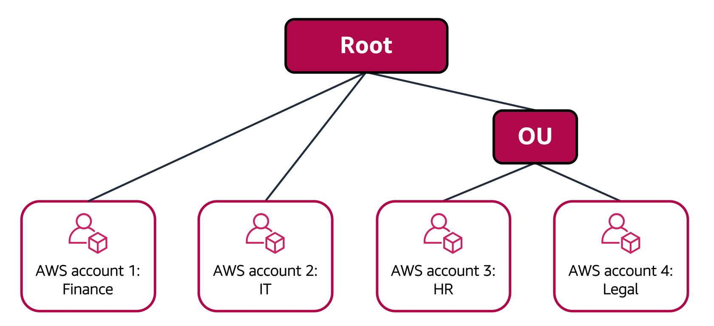
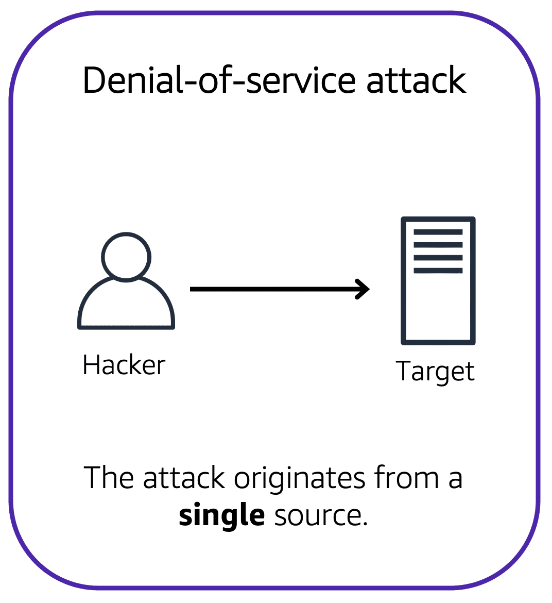
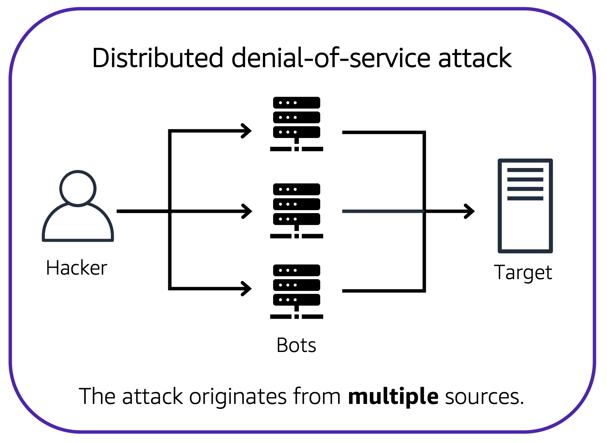
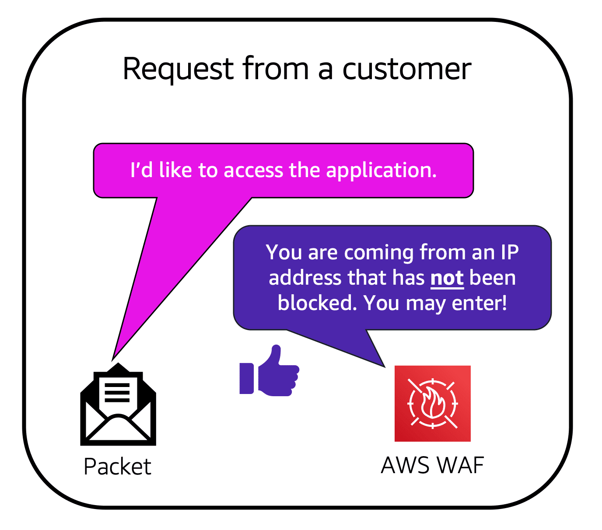
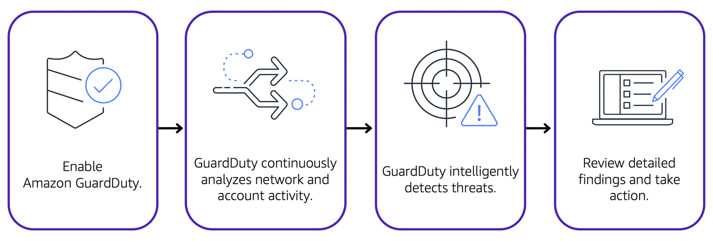

# Module Six: Security

## Module Intro

- Shared Responsbility Model
    - Customers control the security in the cloud 
    - AWS control security of the cloud 
- MFA
- AWS Identify and IAM Security Levels
- Benefits of AWS Orgs
- Security Policies
- Benefits of AWS Compliance
- Additional Security Services

## AWS Shared Responsbility Model

Do not treat env as single objects, AWS views this as a set of parts that build on each other which is where the SharedResponsbility Model comes in. Including components previously discussed such as EC2, S3 Buckets and RDS. 

Customers: responsible for everything they create or put into the AWS Cloud. 

AWS: Responsbile of Security of the Cloud

Example with an EC2 Instance: 

- AWS Resp
    - Physical: iron, concrete, fences etc, physical perimeter
    - NW and Hypervisor: AWS makes these tamper proof
        - Backed up by third party auditors who have gone through the code and the infrastructure 
- Your Resp
    - OS: You and you alone have root encryption key
        - AWS cannot enter your OS
        - the same way a construction builder does not hold a copy of your house keys
        - Your OS team 100% responsible for keeping your OS patched, even if AWS identifies vulnerabilities in your OS, they can notify you but cannot deploy a patch
    - Apps: you own and run and maintain them 
    - Data: always your domain to control
        - Sometimes you want this to be exposed, pictures on a website
        - banking or healthcare, not so much :D

## User Permissions and Access

- Root User can access and control any resources in the account from EC2 instances to block-chain services
- MFA ensures need randomised token to log in
- Root User should not be used for everthing
- Control access in granular way through IAM 
- By default all access are denied
- grant access only to what a user requires -> least priviledged principle
- IAM policy -> IAM user
    - describes what api calls a user can or cannot make 
    - "Effect" "Action" "Resource"
        - Effect --> allow or deny 
        - action --> api call
        - resource --> which AWS resource the api call is for
- IAM Groups makes it easier to manage all this
    - groups of ppl with same access levels needed
- Roles
    - temporary role assignments that change from day to day
    - create identifies in aws called roles with associated permissions
    - roles assumed for temporary amounts of time
    - when an identify assumes a role, it abandons all previous permisssions and assumes permissions of this role

### AWS Identify and Access Management

IAM Features: 

- IAM Users, groups and roles
- IAM Policies
- MFA

### Root User 

- Do not use RU for everyday tasks 
- Instead create other IAM users and access those identities to perform regular tasks throughout AWS

### IAM User 

- when created by defualt has no permissions associated with it
- to allow these users to launch EC2s or create S3 buckets, need to assign it permissions

### IAM Policies 

- Document that allows or denies permissions to AWS services and resources
- Follow least priviledge principle when granting permissions 

Example of IAM Policy:

- Effect: allow or deny 
- Action: api call, list the objects
- Resource: means they're able to view all of the objects in the AWS Doc Example Bucket

### IAM Group

Collection of IAM Users. All users in the group when assigned to it are granted permissions specified by the policy

### IAM Roles

Identity you can assume to gain access to temporary permissions. Before IAM user, application or service can assume an IAM role, they must be granted permissions to switch to the role

### MFA 

- IAM MFA - extra layer of security to your AWS account

## AWS Organisations

- Used to consolidate and manage multiple AWS member accounts within a central location
- When creating org, aws automatically creates a root which is the parent container for all the accounts in your org 
- Service control policies -> enable you to place restrictions on aws services, resources and insivisual api actions that users and roles in each account can access

**IMPORTANT** In AWS Organizations, you can apply service control policies (SCPs) to the organization root, an individual member account, or an OU

_Note, consolidated billing is another feature of AWS organisations_

### Organisational Units

OUs can be used to group accounts to make it easier to manage acounts with smaller businesses or security requirements. 

## Compliance

- Depending on what you host on AWS need to ensure you are compliant
- Customer data in EU -> GDPR 
- Healthcare -> HIPAA
- Need tools to check you meet compliance regulations you're subject to
- AWS Complies with a long list of programmes
    - You just need to make sure the architecture you build is compliant on top of AWS
- Note region you choose to operate out of can also help you meet compliance regulations
- In SRM -> You own the data you store in AWS and can deploy multiple different encryption mechanisms to be confident in your data protection
- AWS Artifacts hold compliance reports against data centres AWS are running to prove they are following best practices for security

### AWS Artifacts 

- Service that provides on demand access to aws secruity and compliance reports plus select online agreements
- Consists of two main sections
    - AWS Artifact Agreements
        - review, accept and manage agreements between you and AWS for individual accounts or all your accounts in your org
    - AWS Artifact Reports
        - compliance reports from third party auditors

### Customer Compliance Centre

- Contains resources to learn more about aws compliance
- Whitepapers/ docs such as
    - answers to compliance questions
    - risk and compliance overviews
    - auditing security check list

## Denial of Service Attacks

- DDoS - Distributed Dinial of Service
- Aim of DDoS is overwhlem capacity of operation to deny anyone of your services 
- Distributed is where the bad actor levredges other machines to all assault your enterpirse
- the key to a good attack is to have the assualt commander do the smallest amount needed and the victim recieve an unbareable workload they can't handle

- Attack Examples
    - UDP Flood
        - Bad actor sends simple request to give me whether
        - then gives all the feedback to your server with MBs of weather forecasts 
        - designed to exhaust your network 
        - _Solution: security groups, not on list, you do not get to talk to server, operates at AWS NW Level, not at instance level (EC2)_
    - HTTP Level Attacks
        - Look like normal customers but ask for complicated product searches over and over again, meaning regular customers can't get in 
    - Slowloris attacks 
        - attacker pretends to have v v slow connection
        - production servers come to standstill waiting for customer to finish sending their request
        - _Solution: ELB, scalable and runs at region level, handles http message first, handling this first before sending it over to the front end webserver_

AWS Shield == specialised defence tools plus AWS WAF which has ML capabilities. Well architected system already well defended against most attacks.

### Denial-of-service attacks

### Distributed Denial-of-Service

- Multiple sorces are used to start an attack that aims to make a website or application unavailable
- singel attacker uses miltiple infected computers (aka bots) to send excessive traffic to website or application

### AWS Shield

To minimise both DoS and DDoS --> USE SHIELD

- Service that protects applications against DDoS attacks - providing two levels of protection, both standard and advanced

#### Shield Standard 

This automatically protects all AWS accounts at no cost, protecting the most common frequently occuring types of DDoS attacks. 

As NW traffic comes into your apps, shield uses a variety of analysis techniques to detect malicious traffic in real time and automatically mitigates it

#### Shield Advanced

Piad Service that provides detailed attack diagnostics and the ability to detect and mitigate sopgisticated DDoS attacks. 

Also integrates with other services such as CloudFront, Route 53 and Elastic Load Balancing. Also, integrate AWS Shield with AWS WAF

Remember WAF == web application firewall

- AWS WAF is a web application firewall that helps protect web applications from attacks by allowing you to configure rules that allow, block, or monitor (count) web requests based on conditions that you define

## Additional Security Services

- Encryption is securing a message or data that can only be accessed by authorised parties
- @ AWS, we have two variations
    - Encryption at rest 
        - E.g. Server side encryption at rest enabled on all Dynamo DB table data
        - this also integrates with AWS KMS
    - Encryption in transition 
        - Means data in transit 
        - Eg have Redshift instance and want to connect with MySQL client
            - use SSL - Secure Sockets Layer
            - can use server certificates to validate and authorise the client
- Amazon Inspector - runs automated sceurity assessment against your infrastrcture and identify deviations against security best practices. Consists of Three Parts: 
    - NW configuration reachability piece
    - Amazon Agent 
    - Security Assessment Service
- GaurdDuty
    - Analyses continues streams of metadata generated from account and NW activity
    - runs independently from other aws services so will not impact performance and availability of your infrastructure and workloads

### AWS KMS

Enables you to perform encryption operations through cryptogrpahic keys. A cryptographic key is a random string of digits used for locking (encrypting) and unlocking (decrypting) data. 

Note, you can specify which IAM users and roles are able to manage keys. the keys never leave AWS KMS and you are always in control of them

### AWS WAF 

This is a web application firewall that lets you minotr network requests that come from your web applications

WAF works together with CloudFront and App Load Balancer.

Similar to NW access control lists covered earlier on in the module, WAF uses web access control lists to allow or block traffic and protect your aws resources. 

### Amazon Inspector

- Runs autoamted security assessments and checks for vulnerabilities in applications plus deviations from security best practices 
- Remember, the recommendations provided will not resolve every security issue, it is the responsbility of the customers to ensure security of their applications, processes and tools that run on aws services

### GuardDuty 

- Intelligent threat detection againsst potential security risks
- GuardDuty monitors data from multiple AWS Sources including vpc flow logs and DNS logs 
- can review findings in AWS Management Console
- Can also configure AWS Lamdba Functions to take remediation steps automatically in repsonse to GaurdDuty security findings

**Gaurd Duty Flow:** 

## Module Six Summary

- Shared Responsbility Model
- Features of AWS Identify and Access Management 
- Methods of managing multiple accounts in AWS Orgs
- AWS compliance resources
- AWS services for applicable security and encryption
