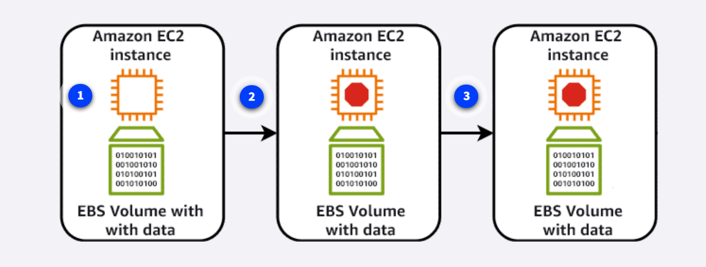
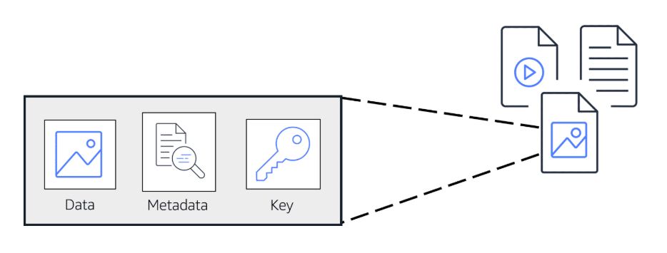

# Discretion and Midas Set Up 

## Architectural Considerations

### Computation in the Cloud 

****

- Will be using genral purpose instance if there's a cloud architecture set up
- balanced mix of compute, memory, and networking resources. They are ideal for diverse workloads, like web services
- also ideal for when workload performance is uncertain (as is the case with the web app development)

### Computing Services - Containers and Virtual Machines

****

- Is there any use of containers to keep the underlying environment consistent an above the web app running on different OSs?
- This question also implicates CI/CD: using containers enables consistent environment when pushing and deploying code from unit testing to production

****

### Networking

### Datastorage 

****

- How will user names, addresses, PII be stored plus sales transactions, image files, video content? 
- It needs various DB management depending on PII implications and file types/ sizes
- Files need to be stored and retrieved as total objects - images for example
- Public and private folders 
- Objects = data, unique ID, metadata 
- Block store = blocks of objects (VIDEOS For example)

****

- How will each users profile data be packed up
- data, metadata and unique identifiers? 
- Or will it be done differentially via something like key value pairs?

**Managing scaling over time**

****

- Backups/ volume storage as more users create profiles 
- needs to expand and increase over time

### Database Management

**Database Considerations**

- How will the data for each of the items be contained/ stored?
    - Multiple RDBs containing PII (Home Address, Profile Images etc.), Financial Security (Card Details,Deposits, etc)
- Using relational DBs with SQL? (Big data tables)
- Key-value pair data storage? -> unique keys used as object identifiers
- Mongo DB tree structure? 

**Caching Layer Considerations**

- reduce strain on backend dbs by query/ api call reduction
- 

### Security and Compliance

### Domain Name Translation to IP Address 

****

- How will the website operate to route end users to itnernet applications hoested in the cloud? 
- For example, is there an equivalent of AWS Route 53 to be used to allow users DNS resolvers to communicate with the DNS Server

****

- How will the website scale requests and manage latency when the website scales nationaly within the UK (and further)? 
- Where will the web application be based initially - is the expectation for it to be ran on a home server or move into one of the key players such as AWS MS Azure, GCP?