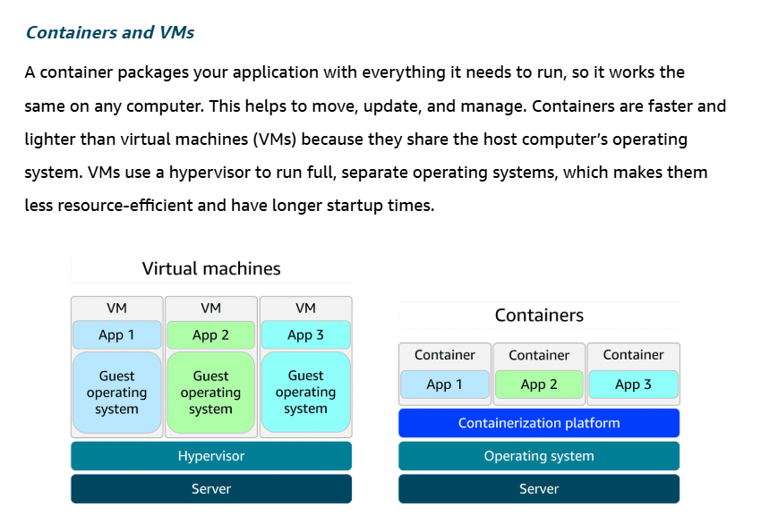
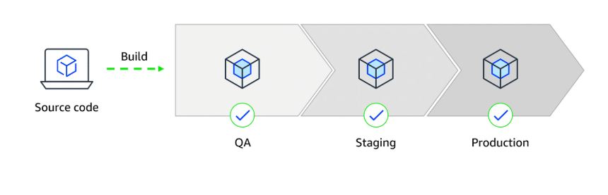

# Discretion and Midas Set Up 

## Architectural Considerations

- APIs Used to access any of the plug ins/ service integrations with other applications?

|Monolithic|Orchestration|
|----------|-------------|
 | |

- Is the web application to be Monolithic based on delivered through Service Orchestration? 
    - If one part of the website service goes down are the other services protected via queuing and messaging Service interfaces?
    - SQS: is there something similar used to ensure reliable communication between SWCs and no message degredation whilst processing is being done by recipient services?

## Computation in the Cloud 

- Will be using genral purpose instance if there's a cloud architecture set up - balanced mix of compute, memory, and networking resources
- How will this compute capacity be set up as needed along with configuration of security, networking and storage?
- Assume general purpose is planned and there's no demand on the compute capacity being optimised for computation or memory based on web app needs?

## Computing Services - Serverless Computing

Running of applications without managing the underlying infrastructure

**Virtual Machines vs Containers**

- Is there any use of containers to keep the underlying environment consistent above the web app running on different OSs?

**CI/CD and Containers in Pipeline/ Deployment**

- CI/CD: using containers enables consistent environment when pushing and deploying code from unit testing to production
- Is there a proposal in place to ensure consistencing in  deployment to production?
- Or is the plan to run on different VMs - if so when setting up CI/CD Runners which VM will this run on?
- What source control mechanisms are proposed for web app deployment - is it to be managed in gitlab or github?

## IaC Considerations

- If going with AWS, GCP, MS Azure, is there anything in place planned to use IaC to deploy the web application but not specify how this is to be achieved
- Template creation in .json to input into one of the providers and leave the provision and configuration of said resources to the cloud providers?

## Data Storage 

**Data Storage Considerations**

- How will user names, addresses, PII be stored plus sales transactions, image files, video content? 
- What files need to be stored and retrieved as objects?
    - Objects = data, unique ID, metadata 
- What files need to be stored and retrieved as block level storage?
    - efficient when working with data bases 

| Block Store UCs   | Object Storage/ Bucket UCs | File Storage UCs |
|--- |---  |---   |
|  |  |  |
| - UCs involved? | - UCs involved? | - UCs involved? |
| - EBS - Storage for EC2 instances/ DBs | Scalable Object Storage for Web assets | Shared File Systems |
| - What files will be compatible with block storage? | - What files need to be stored and retrieved as block level storage? | - What common files are shared across swc's in the application? |

***Fundamental question is how have different file storages been considered against different databses and how can the above three from a UC level be used in a way to scale the web application when the website sees more traffic/ demand on its services?***

**Managing scaling over time: For Example AWS Snapshots**

- Backups/ volume storage as more users create profiles - needs to expand and increase over time
- How does the architecture cater for increasing number of users or users appending more images and metadata to their profile from a storage perspective?

## Database Management

**Database Considerations**

- How will the data for each of the items be contained/ stored?

| Relational DBs | None Relational DBs |
| ---       | ---       |
| - Multiple RDBs containing PII (Home Address, Profile Images etc.), Financial Security (Card Details,Deposits, etc) | - Key-value pair data storage? -> unique keys used as object identifiers |
| - Using relational DBs with SQL? (Big data tables) | - Mongo DB tree structure?  |

**Caching Layer Considerations**

- reduce strain on backend dbs by query/ api call reduction
- Is there content the web application will need to cache to avoid high query rates against DBs?
- For example, when 100's of customers request the same static data over and over again

## Security and Compliance

**NW and App Protection from DoS and DDoS**

- Do different DBs need different security protocals in place
- Protect against DoS attacks and DDoS attacks 
- Is there a use of a firewall against web app to monitor nw requests and check against access control lists? - identify blocked IP Addresses
- What Security considerations are in place to protect against this and how will the web app be pen tested to ensure there's no vulnerabilities

### Domain Name Translation to IP Address 

**Customer and Domain Name Interface**

- How will the website operate to route end users to internet applications hoested in the cloud? 
- For example, is there an equivalent of AWS Route 53 to be used to allow users DNS resolvers to communicate with the DNS Server

**Scaling across multiple Cloud Hosted Applications**

- How will the website scale requests and manage latency when the website scales nationaly within the UK (and further)? 
- Where will the web application be based initially - is the expectation for it to be ran on a home server or move into one of the key players such as AWS MS Azure, GCP?